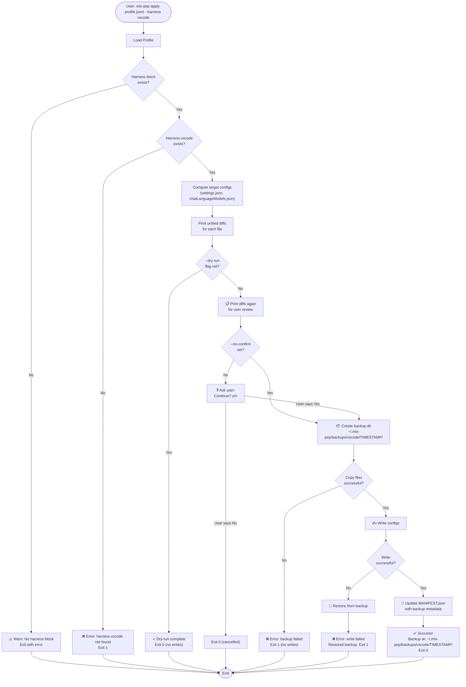

# Harness Integration Design: `mlx-pep apply` Command

**Status:** Design Phase (Research)  
**Related Issue:** #16  
**Related PRD Sections:** 5 (Architecture), 7 (MVP Scope - item 4)  
**Date:** 2026-08-12

---

## 1. Overview

The `mlx-pep apply <profile> --harness copilot-cli|vscode [--insiders] [--dry-run]` command maps a profile's `harness` block to system harness configurations:

- **VS Code** (stable) → `settings.json` + `chatLanguageModels.json`
- **VS Code Insiders** → Insiders-specific locations
- **GitHub Copilot CLI** → Copilot CLI configuration

All writes are preceded by:
1. Dry-run preview (print diff)
2. Timestamped backup of existing files
3. Final write (if not `--dry-run`)

No write occurs if the profile lacks the required harness block.

### 1.1 Dry-Run and Write Flow



---

## 2. File Paths

### 2.1 VS Code Stable

| OS | Path |
|---|---|
| macOS | `~/Library/Application Support/Code/User/settings.json` |
| Linux | `~/.config/Code/User/settings.json` |
| Windows | `%APPDATA%\Code\User\settings.json` |

**Associated files:**
- `chatLanguageModels.json` (same directory as `settings.json`)

**Detection:** Look for VS Code installation via:
- macOS: `/Applications/Visual Studio Code.app` exists or `which code`
- Linux/Windows: `which code`

### 2.2 VS Code Insiders

| OS | Path |
|---|---|
| macOS | `~/Library/Application Support/Code - Insiders/User/settings.json` |
| Linux | `~/.config/Code - Insiders/User/settings.json` |
| Windows | `%APPDATA%\Code - Insiders\User\settings.json` |

**Associated files:**
- `chatLanguageModels.json` (same directory as Insiders `settings.json`)

**Detection:** 
- macOS: `/Applications/Visual Studio Code - Insiders.app` exists or `which code-insiders`
- Linux/Windows: `which code-insiders`

**Flag handling:**
- `--insiders` applies to Insiders-specific paths
- Omit flag (or use `--harness vscode` alone) → stable paths only

### 2.3 GitHub Copilot CLI

**Config location:** `~/.copilot/profiles.json` (or `~/.copilot/config.json`)

**Detection:** `which gh-copilot` or `which copilot`

**Path construction (cross-platform):**
- All paths use `Path.Combine()` and `ExpandUser()` to normalize
- On Windows: convert forward slashes to backslashes automatically

---

## 3. Harness Block Schema

The profile's `harness` field is a free-form dictionary. MVP supports:

```json
{
  "harness": {
    "vscode": {
      "maxInputTokens": 64000,
      "maxOutputTokens": 3072,
      "customSettings": {
        "github.copilot.advanced": { ... }
      }
    },
    "copilotCli": {
      "maxPromptTokens": 64000,
      "contextWindow": 128000,
      "modelId": "gpt-4-turbo"
    }
  }
}
```

**Validation:**
- `harness` must exist (or warn user "profile has no harness block")
- `vscode` and/or `copilotCli` may be present
- Unknown keys are logged as warnings (forward-compatible)
- Missing required keys in a harness section block the apply (e.g., if applying to vscode but no `vscode` block)

---

## 4. VS Code Configuration Mapping

### 4.1 settings.json Handling

**Merge strategy:**
1. Read existing `settings.json` (or create empty object `{}`)
2. Extract `harness.vscode.customSettings` from profile (if present)
3. Merge into `settings.json` using a **deep merge** (don't overwrite entire file)
4. Write updated file

**Example:**

```json
// Existing settings.json
{
  "editor.fontSize": 12,
  "github.copilot.enable": true
}

// Profile harness.vscode.customSettings
{
  "github.copilot.advanced": {
    "listTopK": 5
  },
  "editor.formatOnSave": true
}

// Result
{
  "editor.fontSize": 12,
  "github.copilot.enable": true,
  "github.copilot.advanced": {
    "listTopK": 5
  },
  "editor.formatOnSave": true
}
```

### 4.2 chatLanguageModels.json Handling

**Note:** This file is VS Code's registry of chat language models (Copilot, Claude, etc.).

**Handling:**
- Extract `harness.vscode.chatLanguageModels` (if present) from profile
- Merge into existing `chatLanguageModels.json` using deep merge
- Write the result

**Example structure:**

```json
{
  "models": {
    "gpt-4": {
      "available": true,
      "default": false
    },
    "claude-3": {
      "available": true,
      "default": true
    }
  }
}
```

---

## 5. Copilot CLI Configuration Mapping

**File:** `~/.copilot/profiles.json`

**Strategy:**
1. Read existing `profiles.json` or create empty `{ "profiles": {} }`
2. Extract `harness.copilotCli` from profile
3. Create or update a profile entry with the given name (e.g., profile ID as key)
4. Merge or replace the entry
5. Write back

**Example:**

```json
{
  "profiles": {
    "ornith-35b-balanced-a1b2c3": {
      "maxPromptTokens": 64000,
      "contextWindow": 128000,
      "modelId": "gpt-4-turbo",
      "appliedAt": "2026-08-12T00:35:51Z"
    }
  }
}
```

---

## 6. Dry-Run and Backup Flow

### 6.1 Dry-Run (`--dry-run`)

When `--dry-run` is specified:

1. **Load profile** from disk
2. **Validate harness block** (print warnings for unknown keys)
3. **Compute target configs** (don't write yet)
4. **Print diffs** for each target file:
   - Show side-by-side or unified diff (existing → proposed)
   - Include file path and status (new/modified/unchanged)
5. **Exit without writing** (exit code 0)

**Diff output format:**

```
=== DRY-RUN: Harness Apply ===
Profile: ornith-35b-balanced-a1b2c3
Harness: vscode

[FILE] ~/.config/Code/User/settings.json (MODIFIED)
--- existing
+++ proposed
@@ -1,5 +1,6 @@
 {
   "editor.fontSize": 12,
+  "github.copilot.advanced.listTopK": 5,
 }

[FILE] ~/.config/Code/User/chatLanguageModels.json (NEW)
--- existing
+++ proposed
@@ -0,0 +1,10 @@
+{
+  "models": {
+    "gpt-4": { "available": true }
+  }
+}

--- No actual changes written (--dry-run) ---
```

### 6.2 Backup Before Write

Before writing to production files:

1. **Check if files exist**
2. **Create backup directory:** `~/.mlx-pep/backups/<harness>/<timestamp>/`
   - Timestamp format: `2026-08-12T00.35.51Z` (ISO-8601 with dots for filesystem safety)
3. **Copy each target file** to backup directory
4. **Record backup location** in a log/manifest: `~/.mlx-pep/backups/<harness>/MANIFEST.json`

**Manifest example:**

```json
{
  "backups": [
    {
      "timestamp": "2026-08-12T00:35:51Z",
      "profileId": "ornith-35b-balanced-a1b2c3",
      "harness": "vscode",
      "files": [
        {
          "path": "~/.config/Code/User/settings.json",
          "backupPath": "~/.mlx-pep/backups/vscode/2026-08-12T00.35.51Z/settings.json",
          "sizeBytes": 512,
          "hash": "sha256:abc123..."
        }
      ]
    }
  ]
}
```

### 6.3 Write Flow (Non-Dry-Run)

1. **Validate harness block** (exit with error if missing required keys)
2. **Print dry-run output** (so user sees what's about to happen)
3. **Ask for confirmation** (interactive prompt, or `--no-confirm` flag)
   ```
   Apply profile 'ornith-35b-balanced-a1b2c3' to vscode?
   Files will be backed up to: ~/.mlx-pep/backups/vscode/2026-08-12T00.35.51Z/
   Continue? (y/n)
   ```
4. **Create backup** (copy existing files to backup directory)
5. **Write configs** (update `settings.json`, `chatLanguageModels.json`, etc.)
6. **Print success message** with backup location

---

## 7. Validation and Error Handling

### 7.1 Pre-Apply Validation

| Check | Error/Warning | Action |
|---|---|---|
| Profile `harness` block missing | Warning | Skip harness; proceed if other harnesses ok |
| Harness subsection (e.g., `vscode`) missing when applying | Error | Exit with "harness.vscode not found in profile" |
| Settings file not found (new install) | Info | Create default structure |
| Settings file unreadable (perms) | Error | "Permission denied: ~/.config/Code/User/settings.json" |
| Unknown keys in harness block | Warning | Log "unknown key 'customOption' in harness.vscode" |
| Invalid JSON in existing settings | Error | "Existing settings.json is malformed; restore from backup" |

### 7.2 Dry-Run Validation

- Print all validation errors/warnings
- Still show proposed diffs even if there are warnings
- Exit 0 (not an error in dry-run mode)

### 7.3 Write-Time Validation

- If validation fails, exit 1 **before creating backup**
- If backup creation fails, exit 1 **before writing**
- If write fails (e.g., disk full), restore from backup and exit 1

---

## 8. Data Types and Structures

### 8.1 C# Record Definitions (MlxPep.Core)

```csharp
/// <summary>
/// Represents the result of an apply operation (dry-run or real).
/// </summary>
public record HarnessApplyResult(
    string ProfileId,
    string Harness,  // "vscode" | "copilot-cli"
    bool IsDryRun,
    bool Success,
    string? Error = null,
    List<FileChangeResult> Changes = null!,
    string? BackupLocation = null);

/// <summary>
/// Represents a single file change.
/// </summary>
public record FileChangeResult(
    string FilePath,
    string Status,  // "new" | "modified" | "unchanged"
    string? ExistingContent = null,
    string? ProposedContent = null,
    string? DiffOutput = null);

/// <summary>
/// Handler for a single harness type.
/// </summary>
public interface IHarnessApplier
{
    string HarnessName { get; }
    Task<HarnessApplyResult> ApplyAsync(
        Profile profile,
        bool isDryRun,
        bool requestedInsiders = false);
}
```

---

## 9. Cross-Platform Considerations

### 9.1 Path Expansion

Use consistent utilities:

```csharp
private string ExpandPath(string path)
{
    return path
        .Replace("~", Environment.GetFolderPath(Environment.SpecialFolder.UserProfile))
        .Replace("%APPDATA%", Environment.GetEnvironmentVariable("APPDATA"));
}
```

### 9.2 File Separators

Use `Path.Combine()` and `Path.DirectorySeparatorChar` to avoid hardcoding `/` or `\`.

### 9.3 Line Endings

When writing JSON:
- Use `System.Text.Json` with `WriteIndented = true`
- Preserve line endings of existing files if possible
- Default to `Environment.NewLine`

---

## 10. Command-Line Interface

### 10.1 Apply Command Syntax

```
mlx-pep apply <profile-path-or-id> --harness copilot-cli|vscode [options]

Options:
  --harness HARNESS              Required. Which harness to apply to (copilot-cli | vscode).
  --insiders                     Apply to VS Code Insiders instead of stable. (vscode only)
  --dry-run                      Print diffs without writing.
  --no-confirm                   Skip interactive confirmation prompt.
  --json                         Output result as JSON.
```

### 10.2 Examples

```bash
# Apply profile from file to VS Code, dry-run
mlx-pep apply ./profile.jsonl --harness vscode --dry-run

# Apply profile to VS Code Insiders with confirmation
mlx-pep apply ornith-35b-balanced-a1b2c3 --harness vscode --insiders

# Apply profile to Copilot CLI, no confirmation, JSON output
mlx-pep apply ~/profiles/my-profile.jsonl --harness copilot-cli --no-confirm --json

# Apply and get JSON result
mlx-pep apply profile.jsonl --harness vscode --dry-run --json
```

---

## 11. Future Extensions (Fast-Follow)

- **OpenCode** harness: map `harness.opencode` block
- **Claude Code** harness: map `harness.claudecode` block
- **Profile activation:** remember "last applied" profile per harness
- **Rollback:** `mlx-pep apply --rollback <harness>` to restore from backup

---

## 12. Testing Strategy

### Unit Tests (MlxPep.Core.Tests)

- Profile parsing with various harness block structures
- Path expansion on macOS, Linux, Windows (mocked)
- JSON merge logic (deep merge preserves existing keys)
- Validation rules (missing blocks, unknown keys)
- Diff generation

### Integration Tests (MlxPep.Cli.Tests)

- End-to-end dry-run on temp directories
- Backup creation and restore
- File write and verification
- CLI argument parsing

### Manual Validation

- On macOS: apply to real VS Code, verify settings.json + chatLanguageModels.json
- On Linux: verify `~/.config/Code/` paths
- On Windows: verify `%APPDATA%\Code\` paths
- Verify backups are created and discoverable

---

## 13. Summary

| Aspect | Details |
|---|---|
| **Input** | Profile (JSONL) + harness type + options |
| **Output** | VS Code/Copilot CLI config files + backup + diff preview |
| **Key Features** | Dry-run, timestamped backups, deep merge, cross-platform paths |
| **Error Handling** | Pre-apply validation, permission checks, backup on write failure |
| **CLI** | `mlx-pep apply <profile> --harness vscode\|copilot-cli [--insiders] [--dry-run] [--no-confirm]` |

---

## 14. References

- **PRD:** docs/PRD.md sections 5 (Architecture) and 7 (MVP Scope)
- **Profile Schema:** docs/profile-schema.md
- **Issue:** #16 harness: apply profile to Copilot CLI + VS Code/Insiders
- **Related Issues:** #3 (UC3), #1 (MVP umbrella)
