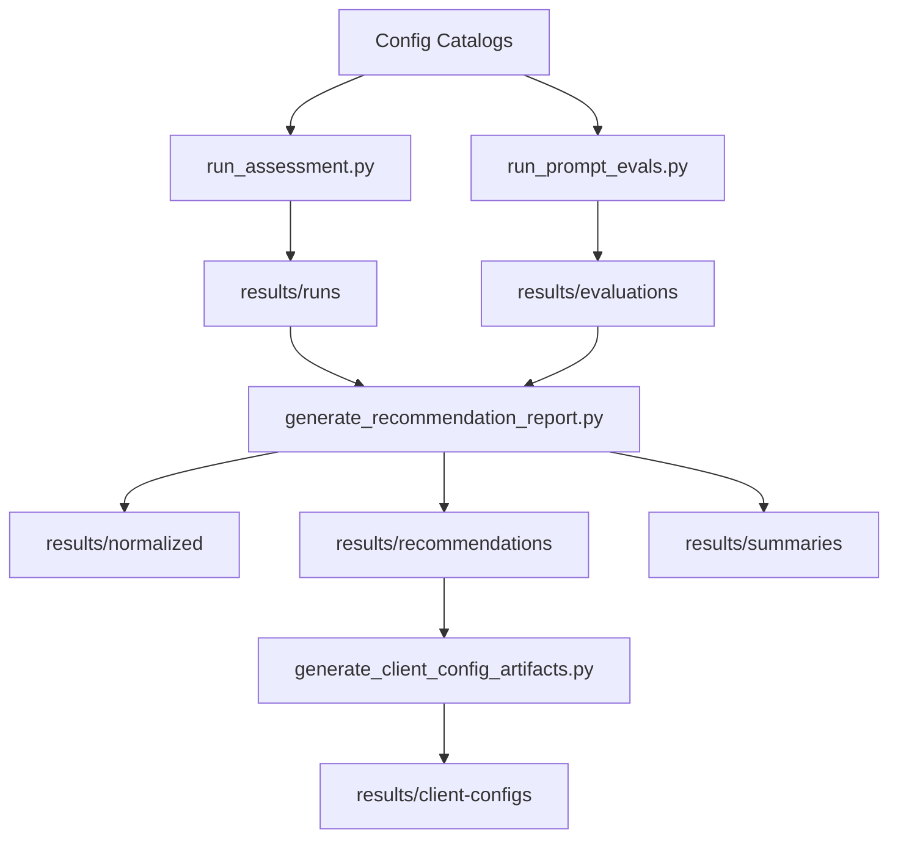

# Repository Architecture

This document is the long-lived architecture reference for the `model-assessor` repository.

Use this file for the stable design of the repository as it exists today. The Chunk 6 handoff and the chunked implementation docs remain useful during active validation, but they are temporary planning material rather than the long-term architecture record.

## Purpose

This repository exists to assess oMLX-exposed local models with deterministic scripts, collect traceable evidence, and translate that evidence into operator-facing recommendations.

The repository is designed to answer four questions for a target model and optional assistant model:

1. Which benchmark profile is best for each workload?
2. When does MTP help, hurt, or remain neutral?
3. When is an assistant-model path supported by oMLX and worth recommending?
4. What workload-specific values should an operator apply in oMLX and reference when configuring downstream AI harnesses?

## Design Principles

### Deterministic first

Settings application, assistant probing, benchmark execution, prompt-quality execution, normalization, manifest generation, and client artifact generation are deterministic script work.

### Evidence before interpretation

Recommendations are derived from persisted artifacts under `results/`, not from freeform judgment alone.

### oMLX is the runtime authority

oMLX inventory, profile fields, selected-model settings, guarded probe outcomes, and benchmark results are authoritative for runtime behavior.

### Model-agnostic structure

The repository uses `gemma-4-12B-it-bf16` as the first validated target, not as a special-case architecture assumption.

## High-Level System

## Core Components

### Config catalogs

The stable machine-readable inputs live under `config/`.

- `benchmark_profiles.json`: workload-specific benchmark and settings profiles
- `smoke_suite.json`: reduced benchmark subset for faster validation
- `prompt_templates.json`: workload prompt templates
- `evaluation_cases.json`: synthetic evaluation cases
- `practical_evaluation_cases.json`: narrower practical live-use cases

### Benchmark and probe runner

The live benchmark and probe entrypoint is `scripts/next_phase/run_assessment.py`.

Responsibilities:

- authenticate against the oMLX admin API
- capture model inventory, profile fields, selected-model state, and generation config
- probe assistant-model compatibility safely
- require explicit assistant-model selection for VLM-backed MTP runs instead of inheriting draft-model state from the live server
- apply merged per-profile settings through full-body settings `PUT`
- run benchmarks and persist SSE and final results
- emit `run_manifest.json`, `assistant_probe.json`, `instance_topology.json`, and `profile_execution_plan.json`

### Prompt-quality evaluator

The live or offline evaluation entrypoint is `scripts/next_phase/run_prompt_evals.py`.

Responsibilities:

- validate fixtures and case definitions
- render prompt templates with fixture-backed values
- run prompt-quality cases against a selected profile
- clear inherited assistant state for assistantless runs and require explicit assistant-model selection for VLM-backed MTP cases
- persist raw outputs and derived scoring artifacts
- support offline validation and bounded live runs through `--validate-only`, `--dry-run`, and `--max-tokens-override`

### Normalization and recommendation generation

The evidence aggregation entrypoint is `scripts/next_phase/generate_recommendation_report.py`.

Responsibilities:

- correlate run and evaluation artifacts
- normalize speed and prompt-quality evidence
- emit conservative ranked workload recommendations
- declare `instance_topology` for downstream consumers
- generate operator-facing Markdown summaries

### AI harness reference generation

The downstream recommendation entrypoint is `scripts/next_phase/generate_client_config_artifacts.py`.

Responsibilities:

- consume a recommendation manifest
- emit one per-run AI harness reference table with one row per workload recommendation and supported harness
- preserve instance-topology guidance for operators
- document official harness terminology beside recommended values, without claiming all oMLX settings are native client keys
- document unsupported client-native settings separately from oMLX-side settings

## Execution Modes

### Single-instance sequential mode

This is the simplest operator mode and the current validation focus.

Characteristics:

- one live oMLX instance
- one exact scenario at a time
- settings are reapplied between runs
- no need to keep separate ports open concurrently

This mode is operationally sufficient for collecting evidence and completing the current validation batch.

### Topology-aware multi-instance mode

This mode is for operators who want multiple workload-specific configurations hosted concurrently.

Characteristics:

- separate ports for distinct simultaneously hosted configurations
- routing driven by the shared `instance_topology` contract
- used by `run_assessment.py` when `--topology-manifest` is supplied

This mode is a deployment and convenience optimization, not a requirement for normal validation.

## Artifact Model

The repository writes traceable outputs under `results/`.

- `results/runs/`: benchmark and probe evidence
- `results/evaluations/`: prompt-quality evidence
- `results/normalized/`: normalized evidence used for ranking
- `results/recommendations/`: machine-readable recommendation manifests
- `results/client-configs/`: review-only AI harness reference tables and structured backing manifests
- `results/summaries/`: readiness reports, recommendation summaries, and operator working notes

The stable artifact contract is maintained in `results/README.md` and `docs/06-next-phase-chunks/shared-contracts.md` until the temporary planning docs are retired.

## Authority Boundaries

### Deterministic authority

Deterministic scripts are authoritative for:

- generated JSON structure
- extracted metrics
- settings requests and settings responses
- benchmark and evaluation traceability
- recommendation and client-artifact emission

### AI-assisted scope

AI may assist with:

- architecture review
- model-family research and caveats
- operator-facing narrative
- identifying likely design problems from completed evidence

AI is not the authority for local availability, assistant compatibility, benchmark truth, or manifest correctness.

## Current Architecture Constraints

- oMLX benchmarking is driven through the admin HTTP API, not a dedicated benchmark CLI.
- Assistant-model support is workload- and runtime-sensitive, so probing must remain guarded and evidence-backed.
- VLM-backed MTP evidence is only considered reproducible when the assistant model is explicit in the invocation or topology, not merely present in inherited selected-model settings.
- Recommendation artifacts are advisory outputs for operator review and must not auto-apply live oMLX or AI harness configuration.
- Some long and deep prompt-quality evaluations are still runtime-expensive and may require bounded token overrides during validation.

## Stable Entry Points

These are the primary long-term script entry points:

- `python3 scripts/next_phase/run_assessment.py ...`
- `python3 scripts/next_phase/run_prompt_evals.py ...`
- `python3 scripts/next_phase/generate_recommendation_report.py ...`
- `python3 scripts/next_phase/generate_client_config_artifacts.py ...`

## Relationship To Temporary Planning Docs

The files under `docs/06-next-phase-*` and `docs/07-local-model-assessor-architecture.md` still matter during the active validation period because they capture the original handoff and interface reasoning.

They should eventually be reduced or retired only after:

1. the single-instance validation batch is complete,
2. the stable behavior has been confirmed end to end, and
3. any remaining contract changes have been folded into the long-lived docs.
